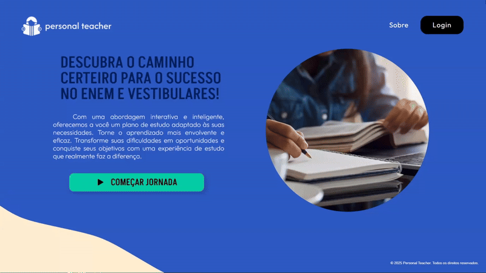
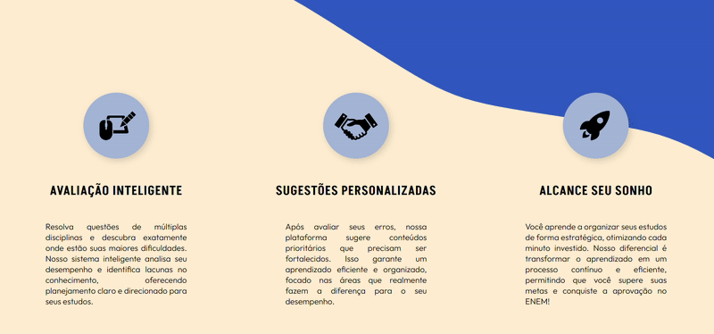
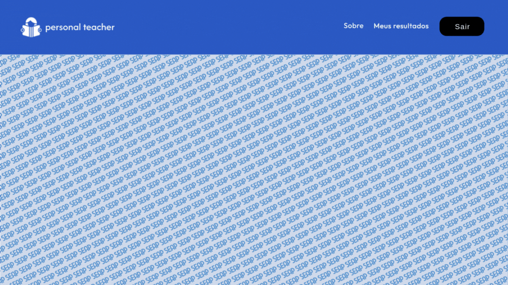
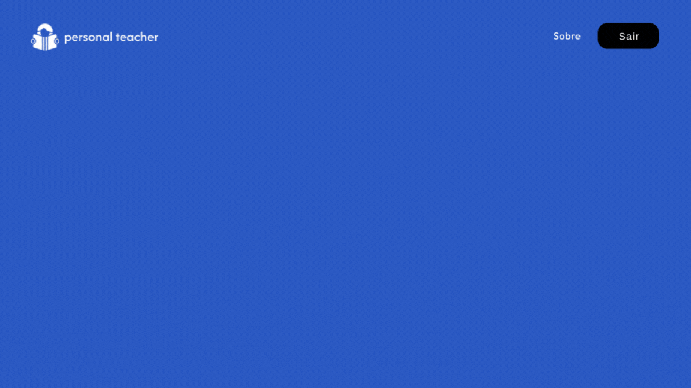
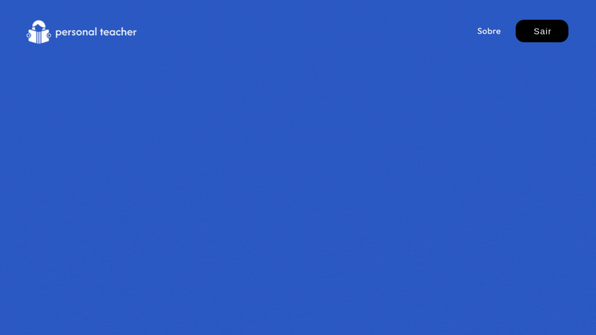

# 📚 Personal Teacher

Bem-vindo ao repositório do Personal Teacher! Este é um projeto de uma plataforma de estudos inteligente e personalizada, desenvolvida para auxiliar estudantes em sua jornada de preparação para o ENEM e outros vestibulares.

## 📌 O Problema

Muitos estudantes que se preparam para grandes exames enfrentam dificuldades em adaptar seus métodos de estudo às suas necessidades específicas.  Em um mercado educacional saturado de materiais genéricos, a falta de um direcionamento claro e personalizado gera desorientação, frustração e, em muitos casos, a desistência.

O principal desafio identificado é a falta de ferramentas que ajudem o aluno a entender suas próprias dificuldades e a focar no que realmente importa, otimizando seu tempo de estudo.

## 😼 Nosso Propósito

O Personal Teacher surge como uma solução para esse problema, atuando como um tutor particular digital. Nossa plataforma foi criada para resolver uma das maiores dúvidas de quem se prepara para o ENEM: **"Por onde começar?"**.

Através de uma avaliação de desempenho inteligente com questões oficiais do ENEM, identificamos os pontos fracos de cada aluno. Com base nos resultados, o sistema oferece sugestões de estudo e um plano focado nas áreas que mais precisam de atenção, tornando o aprendizado mais eficiente, envolvente e eficaz.

**Nosso objetivo é transformar a forma como as pessoas estudam, oferecendo uma abordagem mais inteligente e, acima de tudo, pessoal.**

## 💡 Funcionalidades Principais

Nossa primeira versão já conta com uma interface simples, rápida e intuitiva, com as seguintes funcionalidades:

**🏠 Home Page:** Apresentação inicial do projeto e do seu propósito.

**👤 Cadastro e Login:** Área para que os usuários possam criar e acessar suas contas.

**📝 Página de Avaliação:** Ambiente onde o aluno realiza o exame, com questões selecionadas aleatoriamente e tempo cronometrado. A prova é composta por 21 questões com duração de 2 horas e 30 minutos.

**📊 Página de Resultados:** Após a finalização do exame, o aluno recebe um *feedback* detalhado sobre seu desempenho, com porcentagem de acertos por tema.

**📈 Histórico de Provas:** Uma área de perfil onde o usuário pode acompanhar seu progresso, rever avaliações passadas e identificar pontos de melhoria contínua.

**📄 Sobre Nós:** Uma seção que conta a história do projeto e dos desenvolvedores.

## 💻 Tecnologias Utilizadas

Para construir o Personal Teacher, utilizamos uma stack de tecnologias modernas e eficientes, garantindo uma aplicação robusta e escalável.

|      Categoria      |         Tecnologia       |                                  Descrição                                 |
|                     |                          |                                                                            |
|    **Front-End**    |     `React com Vite`     | Para a criação de uma interface de usuário reativa, rápida e moderna.      |
|    **Back-End**     |   `Node.js com Express`  | Para gerenciar, processar dados e se comunicar com o banco de dados.       |
|    **Back-End**     |       `Prisma ORM`       | Ferramenta para facilitar a interação e as operações com o banco de dados. |
|  **Banco de Dados** |       `PostgreSQL`       | Confiável para armazenar os dados dos usuários, questões e resultados.     |
|    **Hospedagem**   |     `Vercel / Render`    | Para o deploy e disponibilização da aplicação na web.                      |

## 🚀 Próximos Passos

Nossos planos futuros para a plataforma incluem:

**🤖 Integração com Inteligência Artificial:** Para criar novas questões adaptadas, corrigir redações e fornecer *feedback* ainda mais detalhado. 
**📚 Expansão de Conteúdo:** Adicionar novas matérias, outros exames e até mesmo cursos de línguas estrangeiras. 

## 🧑‍💻 Colaboradores

Este projeto foi desenvolvido com muito carinho por:

* **Thaynara Nascimento**
* **Gabriel Trojack**
* **Victor Ribeiro**

---